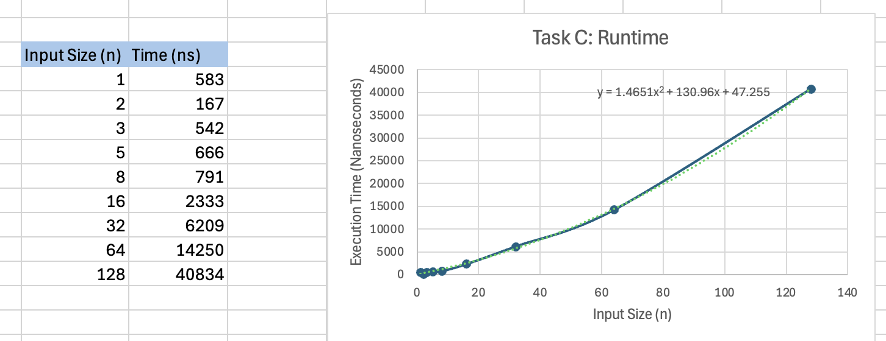

# COP4533-Matching-and-Verifying

**Students:**

Heiryn Hernandez Rojas - 90988659

Maite Chapartegui - 54536135

## Files
Within src folder:
* `matcher.cpp`: Holds the G-S algorithm, timer and stability checker
* `hospitalStudents.cpp`: Has the Hospital and Student struct
Within data folder:
* `examplen.txt`: The input values ranging from 1-128
* `examplen.out`: the output with the stable matches

## Compilation
Our program is written in C++
To compile the code, 

1. Clone the repo on your device:
git clone https://github.com/maitechapartegui/COP4533-Matching-and-Verifying.git

2. Compile in VSCode (or IDE of your choosing) terminal
g++ -std=c++17 .\src\matcher.cpp -o matcher
.\matcher.exe .\data\example.in

- to change input file, just edit the path in the second command

### Our assumptions:
- We assumed that every hospital provides a preference ranking for all *n* students, and every student ranks all *n* hospitals.
- We assumed that this is a hospital-proposing implementation, meaning that the resulting stable matching is "hospital-optimal"
- We assumed the input *n* to be a positive integer
- We assume every candidate/hospital has a unique rank.

## TASK C
Using the C++ <chrono> library: 
- We placed the timers immediately before and after the core while loop to capture only the execution time of the Gale-Shapley algorithm, specifically excluding the time spent on file I/O (input/output).
    This was done with code like:
    - `    auto start = chrono::high_resolution_clock::now();`
    - `auto end = chrono::high_resolution_clock::now();`
    - `auto duration = chrono::duration_cast<chrono::nanoseconds>(end - start);`

We ran a variety of different tests getting their duration in nanoseconds.

- inputs:1, time: in ns 583
- inputs:2, time: in ns 167
- inputs:3, time: in ns 542
- inputs:5, time: in ns 666
- inputs:8, time: in ns 791
- inputs:16, time: in ns 2333
- inputs:32, time: in ns 6209
- inputs:64, time: in ns 14250
- inputs:128, time: in ns 40834

*As you can see with the graph: our algorithm follows the O(n^2) trend. This means that it is correctly aligned with the expected trend. With n hospitals making up to n proposals each, the total number of iterations is worst-case at n^2* 

